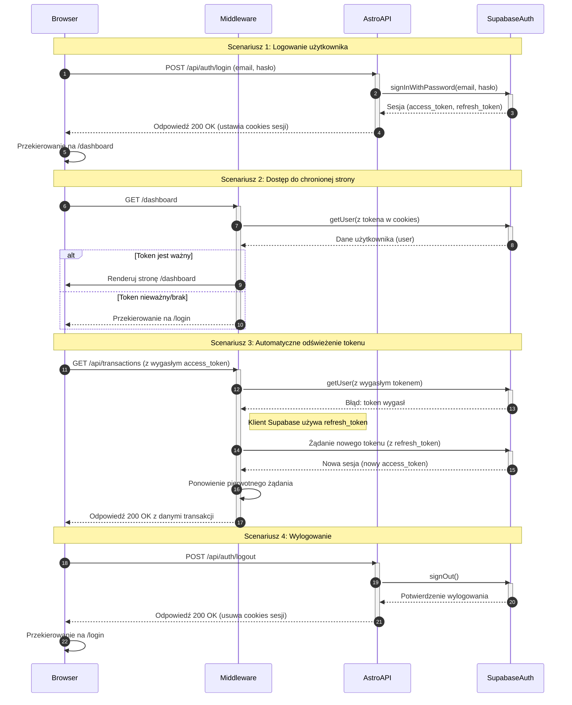

<authentication_analysis>
### 1. Przepływy Autentykacji

Na podstawie dokumentacji (`prd.md`, `auth-spec.md`) zidentyfikowano następujące przepływy autentykacji:
- **Rejestracja Użytkownika:** Tworzenie nowego konta za pomocą adresu e-mail i hasła, z krokiem weryfikacji e-mail.
- **Logowanie Użytkownika:** Uwierzytelnianie za pomocą e-maila i hasła w celu uzyskania dostępu do chronionych zasobów.
- **Wylogowanie Użytkownika:** Bezpieczne zakończenie sesji użytkownika i unieważnienie tokenów.
- **Resetowanie Hasła:** Proces odzyskiwania dostępu do konta przez użytkownika, który zapomniał hasła.
- **Zarządzanie Sesją:** Ochrona stron i endpointów API za pomocą middleware, które weryfikuje tokeny sesji.
- **Automatyczne Odświeżanie Tokenu:** Mechanizm klienta Supabase, który odświeża wygasające tokeny dostępu bez interwencji użytkownika, zapewniając ciągłość sesji.
- **Dostęp do Chronionych Zasobów:** Weryfikacja tokenu przy każdym żądaniu do chronionych stron lub API.

### 2. Główni Aktorzy i Ich Interakcje

- **Przeglądarka (Browser):** Klient użytkownika, który inicjuje wszystkie żądania (logowanie, dostęp do stron, itp.) i przechowuje tokeny w cookies.
- **Middleware (Astro):** Warstwa pośrednicząca, która przechwytuje każde żądanie. Jej zadaniem jest weryfikacja tokenu sesji, przekierowywanie niezalogowanych użytkowników i dołączanie danych użytkownika do kontekstu żądania.
- **Astro API:** Zestaw serwerowych endpointów (`/api/auth/*`), które obsługują konkretne operacje autentykacyjne (logowanie, rejestracja) poprzez komunikację z Supabase.
- **Supabase Auth:** Zewnętrzna usługa (dostawca tożsamości), która zarządza bazą użytkowników, wystawia i weryfikuje tokeny JWT (Access Token, Refresh Token) oraz obsługuje logikę uwierzytelniania.

### 3. Procesy Weryfikacji i Odświeżania Tokenów

- **Weryfikacja:** Przy każdym żądaniu do chronionego zasobu, `Middleware` pobiera token dostępu z `Astro.cookies` i wysyła go do `Supabase Auth` w celu weryfikacji (`supabase.auth.getUser()`). Jeśli token jest ważny, żądanie jest kontynuowane.
- **Odświeżanie:** Biblioteka kliencka Supabase automatycznie zarządza odświeżaniem tokenów. Gdy token dostępu (krótkożyjący) wygasa, biblioteka w tle używa tokenu odświeżania (długożyjącego, przechowywanego w bezpiecznym `httpOnly` cookie) do uzyskania nowego tokenu dostępu od `Supabase Auth`. Proces ten jest przezroczysty dla użytkownika.

### 4. Opis Kroków Autentykacji

1.  **Logowanie:** Użytkownik wysyła formularz z `Przeglądarki` do `Astro API`. API przekazuje dane do `Supabase Auth`. Po pomyślnej weryfikacji, Supabase zwraca sesję, a API ustawia w przeglądarce `httpOnly` cookies z tokenami.
2.  **Dostęp do zasobu:** `Przeglądarka` wysyła żądanie do chronionej strony (np. `/dashboard`). `Middleware` przechwytuje żądanie, weryfikuje token z `Supabase Auth`. Jeśli jest poprawny, strona jest renderowana.
3.  **Wygasła sesja:** Jeśli `Middleware` stwierdzi, że token wygasł (i nie da się go odświeżyć), przekierowuje użytkownika z powrotem do strony logowania.
4.  **Odświeżenie tokenu:** Jeśli token dostępu wygasł, ale token odświeżania jest ważny, klient Supabase automatycznie żąda nowego tokenu od `Supabase Auth` i ponawia pierwotne żądanie.

</authentication_analysis>
<mermaid_diagram>

</mermaid_diagram>

