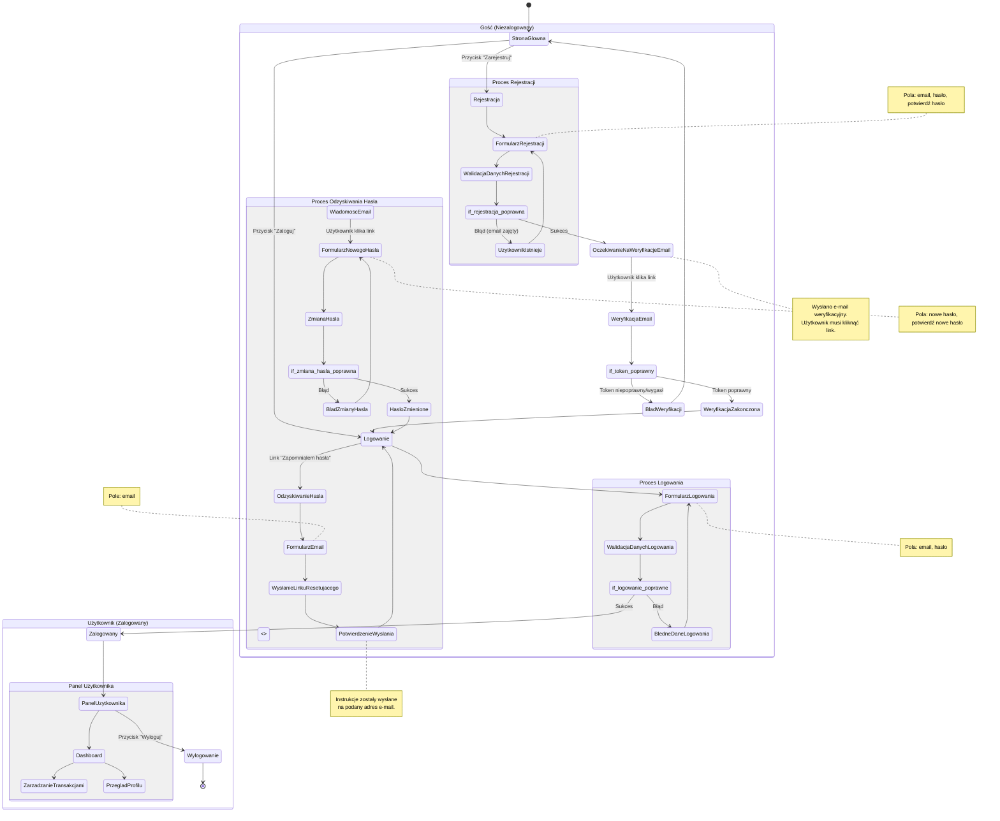

```mermaid
stateDiagram-v2
    [*] --> StronaGlowna

    state "Gość (Niezalogowany)" as Gosc {
        StronaGlowna --> Logowanie: Przycisk "Zaloguj"
        StronaGlowna --> Rejestracja: Przycisk "Zarejestruj"
        Logowanie --> OdzyskiwanieHasla: Link "Zapomniałem hasła"

        state "Proces Rejestracji" as ProcesRejestracji {
            Rejestracja --> FormularzRejestracji
            note left of FormularzRejestracji
                Pola: email, hasło, potwierdź hasło
            end note
            FormularzRejestracji --> WalidacjaDanychRejestracji
            WalidacjaDanychRejestracji --> if_rejestracja_poprawna <<choice>>
            if_rejestracja_poprawna --> UzytkownikIstnieje: Błąd (email zajęty)
            UzytkownikIstnieje --> FormularzRejestracji
            if_rejestracja_poprawna --> OczekiwanieNaWeryfikacjeEmail: Sukces
            note right of OczekiwanieNaWeryfikacjeEmail
                Wysłano e-mail weryfikacyjny.
                Użytkownik musi kliknąć link.
            end note
        }

        OczekiwanieNaWeryfikacjeEmail --> WeryfikacjaEmail: Użytkownik klika link
        WeryfikacjaEmail --> if_token_poprawny <<choice>>
        if_token_poprawny --> WeryfikacjaZakonczona: Token poprawny
        WeryfikacjaZakonczona --> Logowanie
        if_token_poprawny --> BladWeryfikacji: Token niepoprawny/wygasł
        BladWeryfikacji --> StronaGlowna

        state "Proces Logowania" as ProcesLogowania {
            Logowanie --> FormularzLogowania
            note right of FormularzLogowania
                Pola: email, hasło
            end note
            FormularzLogowania --> WalidacjaDanychLogowania
            WalidacjaDanychLogowania --> if_logowanie_poprawne <<choice>>
            if_logowanie_poprawne --> Zalogowany: Sukces
            if_logowanie_poprawne --> BledneDaneLogowania: Błąd
            BledneDaneLogowania --> FormularzLogowania
        }

        state "Proces Odzyskiwania Hasła" as ProcesOdzyskiwaniaHasla {
            OdzyskiwanieHasla --> FormularzEmail
            note left of FormularzEmail
                Pole: email
            end note
            FormularzEmail --> WysłanieLinkuResetujacego
            WysłanieLinkuResetujacego --> PotwierdzenieWyslania
            note right of PotwierdzenieWyslania
                Instrukcje zostały wysłane
                na podany adres e-mail.
            end note
            PotwierdzenieWyslania --> Logowanie

            WiadomoscEmail --> FormularzNowegoHasla: Użytkownik klika link
            note right of FormularzNowegoHasla
                Pola: nowe hasło, potwierdź nowe hasło
            end note
            FormularzNowegoHasla --> ZmianaHasla
            ZmianaHasla --> if_zmiana_hasla_poprawna <<choice>>
            if_zmiana_hasla_poprawna --> HasloZmienione: Sukces
            HasloZmienione --> Logowanie
            if_zmiana_hasla_poprawna --> BladZmianyHasla: Błąd
            BladZmianyHasla --> FormularzNowegoHasla
        }
    }

    state "Użytkownik (Zalogowany)" as Uzytkownik {
        Zalogowany --> PanelUzytkownika
        PanelUzytkownika --> Wylogowanie: Przycisk "Wyloguj"
        Wylogowanie --> [*]

        state "Panel Użytkownika" as Panel {
            PanelUzytkownika --> Dashboard
            Dashboard --> ZarzadzanieTransakcjami
            Dashboard --> PrzegladProfilu
        }
    }
```
