<architecture_analysis>
Na podstawie dostarczonych dokumentów, oto analiza architektury UI dla modułu autentykacji.

### 1. Wymienione Komponenty

**Strony Astro (`src/pages`):**

- `index.astro`: Publiczna strona docelowa.
- `login.astro`: Strona logowania zawierająca formularz.
- `register.astro`: Strona rejestracji zawierająca formularz.
- `forgot-password.astro`: Nowa strona do inicjowania resetu hasła.
- `profile/reset-password.astro`: Nowa strona do ustawiania nowego hasła po kliknięciu w link.
- `dashboard.astro`: Chroniony pulpit użytkownika.
- `transactions.astro`: Chroniona strona z listą transakcji.
- `profile.astro`: Chroniona strona profilu użytkownika.

**Layouty Astro (`src/layouts`):**

- `Layout.astro`: Główny layout aplikacji, który warunkowo renderuje elementy UI w zależności od stanu uwierzytelnienia.

**Komponenty React (`src/components`):**

- `LoginForm.tsx`: Formularz logowania z walidacją.
- `RegisterForm.tsx`: Formularz rejestracji z walidacją.
- `ForgotPasswordForm.tsx`: Nowy formularz do wysyłania prośby o reset hasła.
- `ResetPasswordForm.tsx`: Nowy formularz do ustawiania nowego hasła.
- `AppHeader.tsx`: Nagłówek aplikacji, wyświetlający różne informacje dla zalogowanych i niezalogowanych użytkowników.
- `AppSidebar.tsx`: Panel boczny z nawigacją, widoczny tylko dla zalogowanych użytkowników.
- `AppFooter.tsx`: Stopka aplikacji.

**Endpointy API (`src/pages/api/auth`):**

- `POST /api/auth/login`: Obsługuje logowanie.
- `POST /api/auth/register`: Obsługuje rejestrację.
- `POST /api/auth/logout`: Obsługuje wylogowanie.
- `POST /api/auth/forgot-password`: Inicjuje proces resetowania hasła.
- `POST /api/auth/reset-password`: Aktualizuje hasło użytkownika.
- `DELETE /api/user/account`: Usuwa konto użytkownika.

**Middleware (`src/middleware/index.ts`):**

- Centralny punkt do zarządzania sesją, ochrony tras i egzekwowania ról.

### 2. Główne Strony i Ich Komponenty

- **Strona Logowania (`/login`):** Strona `login.astro` renderuje komponent `LoginForm.tsx`.
- **Strona Rejestracji (`/register`):** Strona `register.astro` renderuje komponent `RegisterForm.tsx`.
- **Strona Resetowania Hasła (`/forgot-password`):** Strona `forgot-password.astro` renderuje komponent `ForgotPasswordForm.tsx`.
- **Strona Ustawiania Nowego Hasła (`/profile/reset-password`):** Strona `profile/reset-password.astro` renderuje komponent `ResetPasswordForm.tsx`.
- **Strony Chronione (`/dashboard`, `/transactions`):** Używają `Layout.astro`, który wyświetla `AppHeader` w wariancie dla zalogowanego użytkownika oraz `AppSidebar`.

### 3. Przepływ Danych

1.  Użytkownik wchodzi na stronę publiczną, np. `/login`.
2.  Strona `login.astro` renderuje komponent `LoginForm.tsx`.
3.  Użytkownik wypełnia i przesyła formularz. Komponent `LoginForm.tsx` wysyła żądanie `POST` do endpointu `/api/auth/login`.
4.  Endpoint API komunikuje się z Supabase Auth w celu weryfikacji poświadczeń.
5.  Po pomyślnej weryfikacji, middleware (`src/middleware/index.ts`) ustawia cookie sesyjne w odpowiedzi serwera.
6.  Aplikacja po stronie klienta przekierowuje użytkownika na chronioną stronę `/dashboard`.
7.  Middleware przechwytuje żądanie do `/dashboard`, weryfikuje cookie sesyjne, pobiera dane użytkownika i dołącza je do `context.locals`.
8.  Strona `dashboard.astro` jest renderowana wraz z komponentami dla zalogowanego użytkownika (`AppHeader` z danymi profilu, `AppSidebar`).

### 4. Opis Funkcjonalności Komponentów

- **`Layout.astro`**: Działa jako przełącznik, decydując na podstawie `context.locals.user`, czy wyświetlić interfejs dla gościa (linki do logowania/rejestracji), czy dla zalogowanego użytkownika (nawigacja, profil).
- **Formularze React (`LoginForm`, `RegisterForm`, etc.)**: Odpowiadają za interakcję z użytkownikiem, walidację danych wejściowych (przy użyciu Zod) i komunikację z odpowiednimi endpointami API.
- **Endpointy API**: Stanowią warstwę pośredniczącą między frontendem a Supabase. Hermetyzują logikę biznesową, walidują dane i obsługują błędy.
- **Middleware**: Pełni rolę strażnika aplikacji. Chroni strony i API, zarządza sesją i przekierowaniami oraz egzekwuje uprawnienia na podstawie ról.

```mermaid
flowchart TD
    classDef page fill:#D6EAF8,stroke:#3498DB,stroke-width:2px;
    classDef component fill:#E8F8F5,stroke:#1ABC9C,stroke-width:2px;
    classDef api fill:#FEF9E7,stroke:#F1C40F,stroke-width:2px;
    classDef middleware fill:#FADBD8,stroke:#E74C3C,stroke-width:2px;
    classDef external fill:#F5EEF8,stroke:#8E44AD,stroke-width:2px;
    classDef updated fill:#f96,stroke:#333,stroke-width:2px;

    subgraph "Publiczne Strony (Astro)"
        direction LR
        P_Login["/login"]:::page
        P_Register["/register"]:::page
        P_ForgotPassword["/forgot-password"]:::page & updated
        P_ResetPassword["/profile/reset-password"]:::page & updated
    end

    subgraph "Komponenty Formularzy (React)"
        direction LR
        C_LoginForm["LoginForm.tsx"]:::component
        C_RegisterForm["RegisterForm.tsx"]:::component
        C_ForgotPasswordForm["ForgotPasswordForm.tsx"]:::component & updated
        C_ResetPasswordForm["ResetPasswordForm.tsx"]:::component & updated
    end

    subgraph "Endpointy API (Astro)"
        direction TB
        API_Login["POST /api/auth/login"]:::api
        API_Register["POST /api/auth/register"]:::api
        API_Logout["POST /api/auth/logout"]:::api
        API_ForgotPassword["POST /api/auth/forgot-password"]:::api & updated
        API_ResetPassword["POST /api/auth/reset-password"]:::api & updated
    end

    subgraph "Zarządzanie Sesją i Dostępem"
        MW["Middleware (index.ts)"]:::middleware
        SB_Auth["Supabase Auth"]:::external
    end

    subgraph "Layout i Komponenty Współdzielone"
        L_Layout["Layout.astro"]:::page
        C_AppHeader["AppHeader.tsx"]:::component
        C_AppSidebar["AppSidebar.tsx"]:::component
    end

    subgraph "Strony Chronione (Astro)"
        P_Dashboard["/dashboard"]:::page
        P_Transactions["/transactions"]:::page
        P_Profile["/profile"]:::page
    end

    %% Relacje Strony -> Komponenty
    P_Login --> C_LoginForm
    P_Register --> C_RegisterForm
    P_ForgotPassword --> C_ForgotPasswordForm
    P_ResetPassword --> C_ResetPasswordForm

    %% Relacje Komponenty -> API
    C_LoginForm -- "Dane logowania" --> API_Login
    C_RegisterForm -- "Dane rejestracji" --> API_Register
    C_ForgotPasswordForm -- "Adres e-mail" --> API_ForgotPassword
    C_ResetPasswordForm -- "Nowe hasło" --> API_ResetPassword
    C_AppHeader -- "Akcja wylogowania" --> API_Logout

    %% Relacje API -> Supabase
    API_Login -- "Weryfikacja" --> SB_Auth
    API_Register -- "Tworzenie użytkownika" --> SB_Auth
    API_Logout -- "Unieważnienie sesji" --> SB_Auth
    API_ForgotPassword -- "Wysłanie linku" --> SB_Auth
    API_ResetPassword -- "Aktualizacja hasła" --> SB_Auth

    %% Rola Middleware
    User_Browser("Przeglądarka Użytkownika")
    User_Browser -- "Żądanie HTTP" --> MW

    MW -- "Sprawdza sesję" --> SB_Auth
    MW -- "Brak sesji, strona publiczna" --> P_Login
    MW -- "Brak sesji, strona chroniona" --> P_Login
    MW -- "Sesja aktywna, strona publiczna" --> P_Dashboard
    MW -- "Sesja aktywna, strona chroniona" --> P_Dashboard

    %% Relacje Layout -> Strony Chronione
    L_Layout --> P_Dashboard
    L_Layout --> P_Transactions
    L_Layout --> P_Profile
    L_Layout --> C_AppHeader
    L_Layout --> C_AppSidebar

    %% Opis przepływu
    style P_ForgotPassword fill:#f96,stroke:#333,stroke-width:2px
    style P_ResetPassword fill:#f96,stroke:#333,stroke-width:2px
    style C_ForgotPasswordForm fill:#f96,stroke:#333,stroke-width:2px
    style C_ResetPasswordForm fill:#f96,stroke:#333,stroke-width:2px
    style API_ForgotPassword fill:#f96,stroke:#333,stroke-width:2px
    style API_ResetPassword fill:#f96,stroke:#333,stroke-width:2px
```

</architecture_analysis>
<mermaid_diagram>

</mermaid_diagram>
